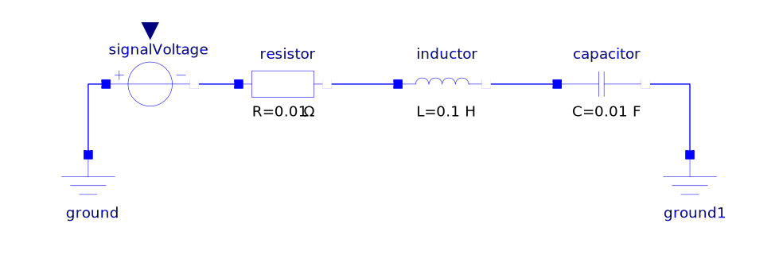
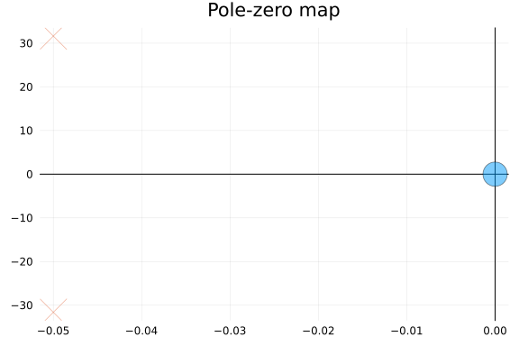

## Introduction

This example studies the oscillatory behavior of an RLC circuit. The system has been linearized using Modelica and exported as a `.mo` file named `RLC_linearized.mo`, located in the `ModelicaModels` repository.

We will extract the matrices $$A, B, C, D$$, build the state-space model in Julia, and perform an eigenvalue analysis to study the system's stability.



>NOTE : This is not an example of electromechanical oscillation! The system is purely electrical. The oscillation is due to the interaction between the inductance and capacitance, which creates a resonant frequency. We show this example as a simple case of oscillation.

---

## Loading the Linear Model

```julia
# Load the function for parsing the Modelica linearized model
include("../ModelicaModels/extractssMatrix.jl")

# Define path to the linearized model
model_path = joinpath(@__DIR__, "../ModelicaModels/RLC_linearized.mo")

# Extract A, B, C, D matrices
A, B, C, D = extract_matrices(model_path)
```

```
([0.0 100.0; -10.0 -0.09999999999999999], [0.0; -10.0;;], [0.0 1.0], [0.0;;
])
```


## Build de state-space model
```julia
sys = ss(A, B, C, D)
```

```
ControlSystemsBase.StateSpace{ControlSystemsBase.Continuous, Float64}
A = 
   0.0  100.0
 -10.0   -0.09999999999999999
B = 
   0.0
 -10.0
C = 
 0.0  1.0
D = 
 0.0

Continuous-time state-space model
```


## Eigenvalue Analysis
We compute the eigenvalues of the system to analyze its stability. The eigenvalues of the system will allow us to determine the resonance frequency and damping ratio.
```julia
using ControlSystems
using Plots
# Compute eigenvalues
p = poles(sys)
# Plot real and imaginary parts
pzmap(sys)
```




We can observe that the eigenvalues are complex conjugates, indicating that the system exhibits oscillatory behavior. As a reminder, the resonance (or natural) frequency $$\omega_n$$ is the frequency at which the system's impedance is minimal, that is, when the inductive and capacitive reactances cancel each other out.

The real part of the eigenvalues is negative, which suggests that the system is stable, thanks to the presence of a resistor in the circuit. The imaginary part corresponds to the oscillation frequency of the system, which matches the frequency calculated from the system's analytical equation. In this case, [the resonance frequency is given by](https://en.wikipedia.org/wiki/RLC_circuit):

$$\omega_n = \frac{1}{\sqrt{LC}} =\frac{1}{\sqrt{0.1*0.01}} = 31.62$$
where $$R$$ is the resistance, $$L$$ is the inductance, and $$C$$ is the capacitance.

The damping ratio $$\zeta$$ is given by: $$\zeta = \frac{R}{2\sqrt{L/C}}$$. In this case, the damping ratio is $$\zeta = \frac{1}{2\sqrt{0.1/0.01}} = 0.5$$.